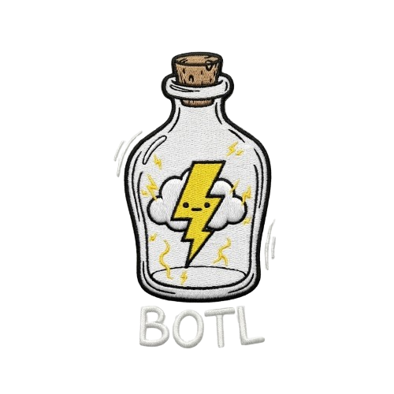
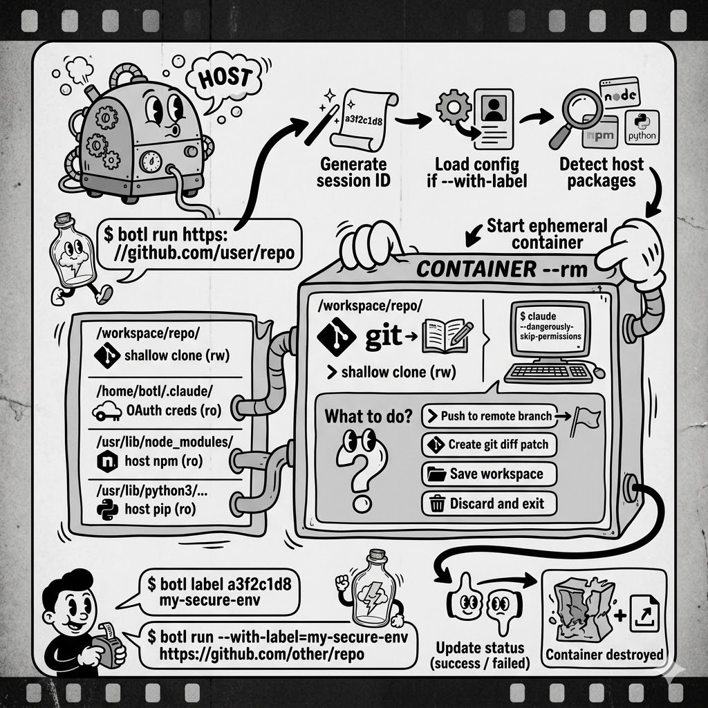

<div align="center">



**Run Claude Code in ephemeral, sandboxed Docker containers.**

[](https://github.com/kamilrybacki/botl/actions/workflows/ci.yml)
[](https://goreportcard.com/report/github.com/kamilrybacki/botl)
[](LICENSE)
[](go.mod)

[Installation](#installation) | [Quick Start](#quick-start) | [Usage](#usage) | [How It Works](#how-it-works) | [Testing](#testing) | [Contributing](#contributing)

</div>

---

## Why

You want Claude Code to work on a repository **without being able to modify anything on your host machine**. `botl` clones the repo inside a throwaway Docker container, mounts your local package caches read-only so builds work, and destroys everything when you're done.

## Prerequisites

- [Go 1.24+](https://go.dev/dl/)
- [Docker](https://docs.docker.com/get-docker/) (running daemon)
- A Claude Pro or Max subscription (authenticate by running `claude` on your host once)

## Installation

```bash
go install github.com/kamilrybacki/botl@latest
```

<details>
<summary><strong>Build from source</strong></summary>

```bash
git clone https://github.com/kamilrybacki/botl.git
cd botl
make build
```

</details>

## Quick Start

```bash
# 1. Build the Docker image (once)
botl build

# 2. Launch an interactive session
botl run https://github.com/user/repo
```

Claude Code starts inside the container with the repo cloned and ready. When you exit, a post-session menu lets you **push**, **export a patch**, or **save the workspace** before the container is destroyed.

## Usage

### `botl run <repo-url>`

Clone a repo into a container and launch Claude Code.

```bash
botl run https://github.com/user/repo                          # interactive
botl run https://github.com/user/repo -b feat/new-thing        # specific branch
botl run https://github.com/user/repo -p "fix lint errors"     # headless mode
botl run https://github.com/user/repo --timeout 1h             # custom timeout
botl run https://github.com/user/repo -m /data:/data           # extra mounts
botl run https://github.com/user/repo -e MY_VAR=value          # extra env vars
botl run https://github.com/user/repo --with-label my-profile  # load a saved profile
```

<details>
<summary><strong>All flags</strong></summary>

| Flag | Default | Description |
|------|---------|-------------|
| `-b, --branch` | repo default | Branch to clone |
| `--depth` | `1` | Git clone depth |
| `-p, --prompt` | _(none)_ | Prompt for headless mode |
| `--mount-packages` | `true` | Auto-detect and mount host packages (ro) |
| `-m, --mount` | _(none)_ | Extra read-only mount `host:container` (repeatable) |
| `--timeout` | `30m` | Max session duration |
| `--image` | `botl:latest` | Docker image to use |
| `-e, --env` | _(none)_ | Extra env vars `KEY=VALUE` (repeatable) |
| `-o, --output-dir` | `./botl-output` | Host directory for exports |
| `--clone-mode` | from config | Clone mode: `shallow` or `deep` |
| `--blocked-ports` | from config | TCP ports to block inbound (comma-separated) |
| `--with-label` | _(none)_ | Load a saved profile as defaults |

</details>

### `botl build`

Build (or rebuild) the Docker image.

```bash
botl build
botl build --image my-custom-botl:v2
```

### `botl config`

View and modify persistent configuration defaults.

```bash
botl config list                          # show all settings
botl config get clone-mode                # get a single value
botl config set clone-mode deep           # set a value
botl config set blocked-ports 8080,3000   # set blocked ports
```

| Setting | Options | Default | Description |
|---------|---------|---------|-------------|
| `clone-mode` | `shallow` / `deep` | `shallow` | Shallow strips commit history and reflog. Deep keeps full history. |
| `blocked-ports` | comma-separated ports | _(none)_ | Block inbound TCP ports inside the container via iptables. |

Config is stored at `~/.config/botl/config.yaml` (XDG-compliant). CLI flags always override config values.

### `botl label`

Save a session's run configuration as a reusable profile.

```bash
botl label <session-id> <name>            # save a session as a profile
botl label a3f2c1d8 my-secure-env         # example
botl label a3f2c1d8 my-env --force        # overwrite existing profile
```

Every `botl run` prints a session ID at the start and end of the session. Use this ID with `botl label` to capture the run's configuration (clone mode, blocked ports, timeout, image, env var keys, etc.) as a named profile for reuse.

### `botl profiles`

Manage saved profiles.

```bash
botl profiles list                        # list all profiles
botl profiles show <name>                 # show profile configuration
botl profiles delete <name>              # delete a profile (with confirmation)
botl profiles delete <name> --yes        # skip confirmation
```

When using `botl run --with-label=<name>`, profile values serve as defaults. CLI flags always override profile values. If the profile requires env vars, botl will check your shell first, then prompt interactively.

**Priority chain:** `CLI flags > profile > config file > built-in defaults`

## How It Works

<div align="center">

</div>

<details>
<summary><strong>Post-session options</strong></summary>

| Option | What it does |
|--------|-------------|
| **Push to a remote branch** | Commits uncommitted changes, prompts for branch name (default: `botl/<timestamp>`), pushes |
| **Create a git diff patch** | Exports all changes as a `.patch` file to `--output-dir` |
| **Save workspace to local path** | Copies the workspace directory to `--output-dir` |
| **Discard and exit** | Throws away everything |

</details>

<details>
<summary><strong>Auto-detected packages</strong></summary>

| Ecosystem | What's mounted |
|-----------|---------------|
| Node.js | Global `node_modules` (via `npm root -g`) |
| Python | `site-packages` directories |
| Go | Module cache (`$GOPATH/pkg/mod`) |
| Rust | Cargo registry (`~/.cargo/registry`) |

Disable with `--mount-packages=false`, or add extras with `--mount`.

</details>

## Testing

All tests run inside a Docker container for reproducible results. The test container uses Docker-in-Docker so E2E tests can build and run botl images.

```bash
make test               # all suites
make test-unit          # internal package unit tests
make test-integration   # CLI command tests
make test-entrypoint    # shell-level entrypoint.sh checks
make test-e2e           # full Docker build + container behavior
make lint               # golangci-lint
```

## Security

| Concern | How it's handled |
|---------|-----------------|
| Host filesystem writes | All package mounts are read-only; only `--output-dir` is writable |
| Repository isolation | Cloned repo lives only inside the container, destroyed on exit |
| Credential safety | `~/.claude` is mounted read-only -- OAuth tokens are reused, not modifiable |
| Container permissions | Runs with `--cap-drop ALL --security-opt no-new-privileges`; `NET_ADMIN` added only when port blocking is configured |
| Claude Code permissions | `--dangerously-skip-permissions` is safe here -- the container itself is the sandbox |
| Inbound port blocking | Optional per-port iptables rules via `botl config set blocked-ports` or `--blocked-ports` |
| Env var secrets | Profile files store env var **keys only**, never values. Values are resolved at runtime from the shell or interactive prompt. |
| Session/profile files | Written with `0600` permissions (owner-only read/write) |
| Profile name validation | Names are validated against `[a-zA-Z0-9][a-zA-Z0-9_-]{0,62}` to prevent path traversal |
| Vulnerability scanning | Every image published to GHCR is scanned with Trivy; results appear in the GitHub Security tab |

## Contributing

Contributions are welcome. Please open an issue first to discuss what you'd like to change.

```bash
git clone https://github.com/kamilrybacki/botl.git
cd botl
make test           # run the full test suite
make lint           # check for lint issues
make build-postrun  # rebuild the embedded botl-postrun binary (commit the result)
```

> If you modify anything under `cmd/botl-postrun/`, run `make build-postrun` and commit the updated `internal/container/dockerctx/botl-postrun` binary so that `go install` continues to work.

## License

[MIT](LICENSE)
